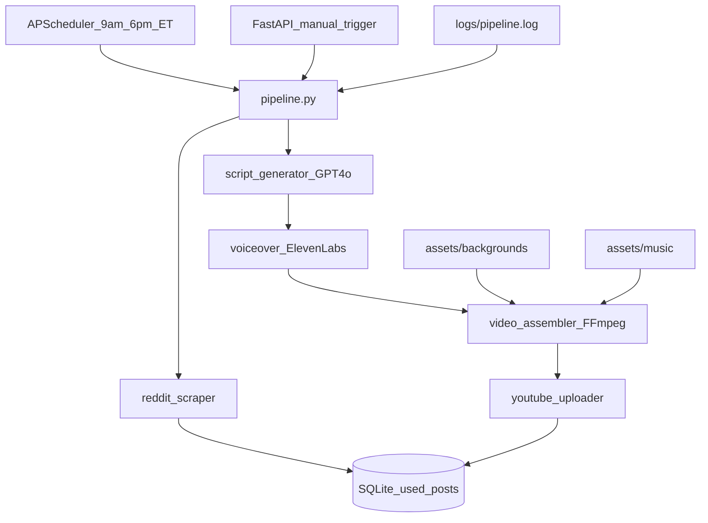

# AITA Automated Video Pipeline

> **Cursor plan copy.** The live plan Cursor uses is at `~/.cursor/plans/aita_video_pipeline_326803fb.plan.md`.

## Build checklist

- [x] Scaffold
- [x] Database
- [x] Reddit scraper
- [x] Script generator
- [x] Voiceover
- [x] Captions
- [x] Video assembler
- [x] YouTube uploader
- [x] Pipeline orchestrator
- [x] Scheduler + FastAPI

## Overview

Scaffold a Python/FastAPI project that scrapes r/AmItheAsshole, generates scripts and voiceovers, assembles vertical short-form videos with FFmpeg, uploads to YouTube, and runs on a twice-daily ET schedule — with SQLite deduplication and file logging.

## Architecture



Each scheduled/manual run processes **one** unused post end-to-end. Failures log and skip without marking the post used (retry on next run).

---

## Phase 0: Project scaffold

```
aita/
├── requirements.txt
├── .env.example
├── .gitignore
├── plan.md
├── app/
│   ├── __init__.py
│   ├── main.py              # FastAPI + scheduler lifespan
│   ├── config.py            # pydantic-settings
│   ├── database.py          # SQLAlchemy engine + session
│   ├── models.py            # UsedPost ORM model
│   ├── schemas.py           # API response schemas
│   ├── scheduler.py         # APScheduler cron (9:00, 18:00 ET)
│   ├── pipeline.py          # Orchestrator
│   ├── services/
│   │   ├── reddit_scraper.py
│   │   ├── script_generator.py
│   │   ├── voiceover.py
│   │   ├── captions.py
│   │   ├── video_assembler.py
│   │   └── youtube_uploader.py
│   └── utils/
│       ├── logging.py
│       └── ffmpeg.py
├── assets/
│   ├── backgrounds/         # user drops .mp4 loops (Minecraft, Subway Surfers)
│   └── music/               # user drops trending audio .mp3/.m4a
├── output/                  # per-run artifacts (gitignored)
├── logs/                    # pipeline.log (gitignored)
└── credentials/             # youtube_token.json (gitignored)
```

**System dependency:** FFmpeg must be installed and on `PATH` (`brew install ffmpeg` on macOS).

### `.env.example` — required secrets

| Variable | Purpose |
|---|---|
| `REDDIT_CLIENT_ID`, `REDDIT_CLIENT_SECRET`, `REDDIT_USER_AGENT` | PRAW |
| `OPENAI_API_KEY` | GPT-4o script generation |
| `ELEVENLABS_API_KEY`, `ELEVENLABS_VOICE_ID` | Voiceover |
| `YOUTUBE_CLIENT_SECRETS_FILE` | OAuth client JSON path |
| `YOUTUBE_TOKEN_FILE` | Stored refresh token |
| `SCHEDULER_TIMEZONE=America/New_York` | 9am / 6pm ET |
| `MIN_UPVOTES=500` | Reddit filter |
| `ASSETS_BG_DIR`, `ASSETS_MUSIC_DIR` | Asset paths |

---

## Phase 1: Core infrastructure

### `app/config.py`

`pydantic-settings` `BaseSettings` loads all env vars with typed defaults (`DATABASE_URL=sqlite:///./aita.db`, asset dirs, API keys).

### `app/utils/logging.py`

- Rotating file handler → `logs/pipeline.log`
- Also stream to stdout for `uvicorn` visibility
- Format: `%(asctime)s [%(levelname)s] %(name)s: %(message)s`

### `app/database.py` + `app/models.py`

SQLAlchemy 2.0 `UsedPost` model with `init_db()` called on app startup.

---

## Phase 2: Reddit scraper — `app/services/reddit_scraper.py`

**Logic:**
1. `praw.Reddit(...)` from config
2. `subreddit.top(time_filter="day", limit=50)`
3. Filter: `score >= 500` AND `created_utc >= now - 24h`
4. Exclude `reddit_id` already in `used_posts` table
5. Return first eligible `RedditPost` dataclass: `id`, `title`, `body`, `score`, `url`, `author`

**Edge cases:** skip `[removed]`/empty bodies, stickied mod posts, image-only posts with no selftext.

---

## Phase 3: Script generator — `app/services/script_generator.py`

**OpenAI GPT-4o** with a structured system prompt enforcing:

| Section | Target |
|---|---|
| Hook | ~5 seconds (~20 words), attention-grabbing question |
| Story | condensed AITA narrative |
| Verdict + hot take | NTA/YTA/ESH + opinion |
| CTA | "Follow for more AITA verdicts" style closer |
| **Total** | **~270 words** (~4 words/sec short-form pace → ~65s VO) |

Return a `Script` dataclass: `full_text`, `hook`, `story`, `verdict`, `cta`, `word_count`.

**Validation:** after generation, check `250 <= word_count <= 290`; retry once if out of range.

---

## Phase 4: Voiceover — `app/services/voiceover.py`

**ElevenLabs** TTS with character-level timestamps for caption sync.

- Save to `output/{reddit_id}/voiceover.mp3`
- Return `VoiceoverResult`: `audio_path`, `duration_seconds`, `alignment`

If duration is outside 60–70s, log a warning (don't block).

---

## Phase 5: Captions — `app/services/captions.py`

Generate **ASS subtitle file** from ElevenLabs alignment data:
- Large bold white text, black outline, bottom-center (TikTok/Shorts style)
- 2–4 words per line, synced to audio timestamps
- Output: `output/{reddit_id}/captions.ass`

Fallback if no alignment: evenly distribute words across `duration_seconds`.

---

## Phase 6: Video assembler — `app/services/video_assembler.py`

Uses `app/utils/ffmpeg.py` as a thin subprocess wrapper.

**Asset selection:** random `.mp4` from `assets/backgrounds/`, random audio from `assets/music/`.

**Steps:**
1. Probe voiceover duration (`ffprobe`)
2. Target video duration: `clamp(vo_duration + 5, 65, 80)` seconds (1:05–1:20 range)
3. Scale/crop background to 1080x1920
4. Loop/trim background to target duration
5. Mix audio: voiceover at 100%, music at 25% volume
6. Burn captions via ASS subtitles filter
7. Encode: `libx264` + `aac`, vertical 9:16
8. Output: `output/{reddit_id}/final.mp4`

---

## Phase 7: YouTube uploader — `app/services/youtube_uploader.py`

**One-time OAuth setup:**
1. Create Google Cloud project, enable YouTube Data API v3
2. Download OAuth client JSON → `credentials/client_secrets.json`
3. Run `python -m app.services.youtube_uploader --auth`

**Upload:** `videos.insert` with title, description, tags; `categoryId = "24"` (Entertainment).

---

## Phase 8: Pipeline orchestrator — `app/pipeline.py`

Wire all services end-to-end. Each run writes artifacts under `output/{reddit_id}/`.

---

## Phase 9: Scheduler — `app/scheduler.py`

APScheduler cron job at **9:00 and 18:00 America/New_York**, `max_instances=1`.

---

## Phase 10: FastAPI app — `app/main.py`

| Endpoint | Method | Purpose |
|---|---|---|
| `/health` | GET | `{"status": "ok"}` |
| `/pipeline/run` | POST | Manual trigger |
| `/posts` | GET | List processed posts |
| `/posts/{reddit_id}` | GET | Single post status + YouTube link |

Run with: `uvicorn app.main:app --host 0.0.0.0 --port 8000`

---

## Build order

1. Scaffold
2. Database
3. Reddit scraper — `python -m app.services.reddit_scraper`
4. Script generator
5. Voiceover
6. Captions
7. Video assembler
8. YouTube uploader
9. Pipeline orchestrator
10. Scheduler + FastAPI

---

## Pre-flight checklist

- [ ] Reddit app created at https://www.reddit.com/prefs/apps (script-type app)
- [ ] OpenAI API key with GPT-4o access
- [ ] ElevenLabs API key + voice ID selected
- [ ] Google Cloud OAuth credentials + YouTube Data API v3 enabled
- [ ] FFmpeg installed (`ffmpeg -version`)
- [ ] At least 2–3 background `.mp4` files in `assets/backgrounds/`
- [ ] At least 2–3 music files in `assets/music/`
- [ ] `.env` filled from `.env.example`

---

## Risks and mitigations

| Risk | Mitigation |
|---|---|
| No eligible posts in 24h window | Log and skip gracefully; `/pipeline/run` retries later |
| ElevenLabs rate limits | Exponential backoff, single post per run |
| YouTube quota (10,000 units/day) | 2 uploads/day ≈ 3,200 units — well within limit |
| Reddit API rate limits | PRAW handles; only fetch top 50/day |
| Script word count drift | Validate + one retry; log actual VO duration |
| Empty asset folders | Fail fast with clear log message |
